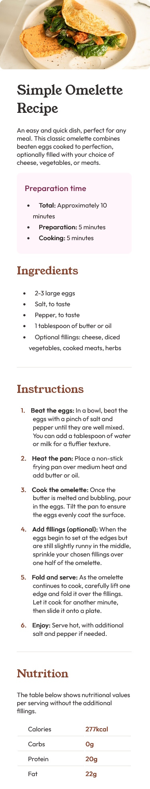

# Frontend Mentor - Recipe page solution

This is a solution to the [Recipe page challenge on Frontend Mentor](https://www.frontendmentor.io/challenges/recipe-page-KiTsR8QQKm). Frontend Mentor challenges help you improve your coding skills by building realistic projects. 

## Table of contents

- [Overview](#overview)
  - [The challenge](#the-challenge)
  - [Screenshot Desktop](#screenshot-desktop)
  - [Screenshot Mobile](#screenshot-mobile)
  - [Links](#links)
- [My process](#my-process)
  - [Built with](#built-with)
  - [What I learned](#what-i-learned)
  - [Continued development](#continued-development)
- [Author](#author)

## Overview

### Screenshot Desktop


### Screenshot Mobile


### Links

- Solution URL: https://github.com/theGamingKitten/recipe-page-main
- Live Site URL: https://thegamingkitten.github.io/recipe-page-main/

## My process

### Built with

- Semantic HTML5 markup
- CSS custom properties
- CSS Grid
- Media Queries

### What I learned

This was the code I used to style the numbers in front of the instructions. Not sure from which tutorial this was.

```css
.instructions {
    list-style: none;
    counter-reset: item;
}

.instructions li {
    counter-increment: item;
    margin-bottom: 15px;
    line-height: 1.3;
}

.instructions li:before {
    content: counter(item) ". ";
    color: var(--nutmeg);
    font-weight: bold;
    margin-right: 10px;
    margin-left: -30px;
}
```

### Continued development

In future projects I want to focus more on making the site look good on various screen sizes. Or even try a mobile-first approach.

## Author

- Frontend Mentor - [@theGamingKitten](https://www.frontendmentor.io/profile/theGamingKitten)
